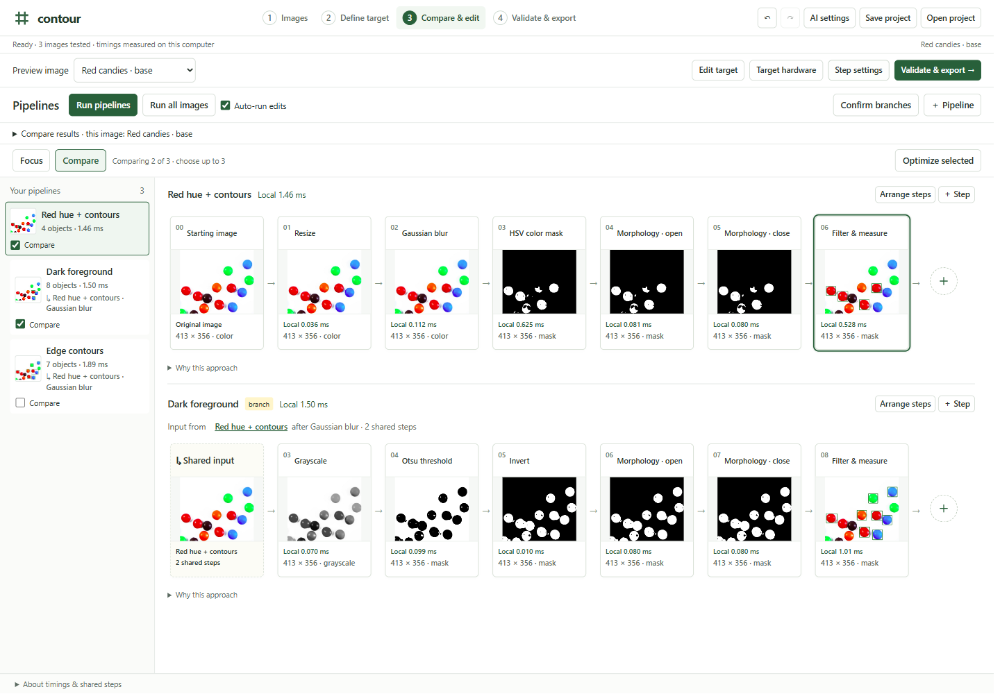

# Contour

A visual workbench for **CPU-only computer vision**. See what every image transform
does, compare alternative pipelines, measure simple objects and export the result as
C++. AI can suggest approaches; the person stays in control.



## Try it locally

Python 3.12 is the tested runtime. The builder needs Python; exported programs do not.

```sh
python -m venv .venv
```

Activate the environment (`.venv\Scripts\Activate.ps1` on Windows, or
`source .venv/bin/activate` on macOS/Linux), then:

```sh
python -m pip install -r requirements.txt
python run.py
```

Open [localhost:8000](http://127.0.0.1:8000). `--no-browser` keeps the launcher from
opening a tab; `--port 8001` uses a different port.

The first run builds the small CImg bridge if a C++17 compiler and CMake are installed.
Other transforms remain available if that build is unavailable. Docker includes the
bridge and the pinned native dependencies.

## Start without an API key

Choose **Images → Example trees · no API key**. Each of the 20 object trees loads
three labeled practice images, measurement choices and editable alternatives, then
runs the whole image family. Try washers with holes, colored candies, connector pins
or pencil length. Eleven additional technique examples are also included.

- **Focus** on a pipeline to change parameters, branch from a step or rearrange
  compatible operations. Shared steps stay connected to their parent.
- **Compare** alternatives using their actual intermediate images and CPU timings.
- **Validate & export** checks the selected pipeline across the family and downloads
  its C++ source, configuration and build instructions.

[Example guide](examples/packs/README.md) ·
[Download 20 saved projects](examples/packs/20-object-trees.zip)

The pack contains four photo families and sixteen generated 2D families. Derived
photo rotations and teaching silhouettes are practice data, not independent evidence
of deployment reliability. Alternative branches may deliberately perform worse.
[Image sources and credits](examples/SOURCES.md).

## Host from this GitHub repository

[Deploy on Render](https://render.com/deploy?repo=https://github.com/hamaker-png/contour-vision)
using the included Dockerfile and `render.yaml`, or use another Linux x86-64 container
host. A hosting account is required; review its service plan before deploying.
[Deployment instructions](DEPLOYMENT.md) cover memory, HTTPS, exact hostnames and limits.

GitHub Pages cannot run the Python/native backend. GitHub stores this project's
source; a running web service gets its own public URL. Public mode disables shared
server keys and remembered keys, limits queued requests, and rejects unknown hosts.
There is no cloud project storage or user-account system.

Uploaded images run on the hosting server's CPU. A visitor's optional OpenAI key
passes through that server to OpenAI for AI requests and is not saved. Projects stay in page memory until saved as a download. Entered keys are cleared
when the page is reloaded or closed.
[Images and API keys](PRIVACY.md).

## How it works

The interface is plain JavaScript and CSS. FastAPI runs the image-processing backend,
using OpenCV, a small CImg bridge, and ZXing-C++. A validated operation graph drives
both the preview and exported C++ code. OpenAI suggestions are structured graph
configurations, not arbitrary executable code.

The selected export includes its required shared and supporting steps. Most exports
use C++17; barcode operations use C++20. Detection needs no Python, model, API key or
GPU at runtime. Compiling the program requires OpenCV development libraries and a
C++ toolchain, with additional dependencies documented in the export.

Measurements include length, width, area, orientation, center and mean color.
Physical dimensions need calibration. Timings for another device are estimates
until measured on that hardware.

[Full workbench guide](docs/WORKBENCH_GUIDE.md) · [Verification record](TESTING.md)

## Development and checks

```sh
python -m pytest -q
node --test tests/*.test.mjs
```

The public-release local suite passes **140 Python tests and 50 JavaScript tests**.
The object pack was exercised on 60 images and 159 branch executions. Three selected
C++ exports were compiled and checked on nine images, matching final preview pixels
and 15 measurement stages. These are bounded regression checks, not a universal
accuracy claim. Live OpenAI responses have not been evaluated with a real key.

GitHub Actions runs the Linux tests and builds and starts the public-mode Docker
container. Check the latest run before deployment. Private local artifacts, build
environments and credentials are excluded from source control.

## Submission materials

[Submission copy](submission/SUBMISSION.md) · [Thumbnail](submission/thumbnail.png) ·
[Demo outline](submission/DEMO_SCRIPT.md)

## License

Original Contour code is [MIT licensed](LICENSE). CImg, ZXing, OpenCV sample images and
other example photographs keep their own licenses and attribution requirements.
See [third-party notices](THIRD_PARTY_NOTICES.md).
